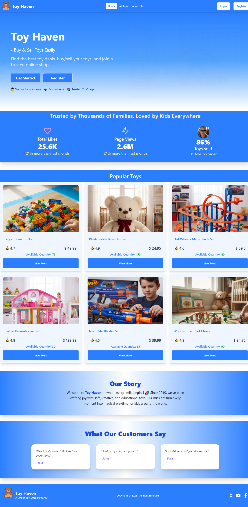

# 🎠 Toy Haven - NextJS Project

**Toy Haven** is a modern and responsive Toy Shop web application built using **NextJS**, **React**, **Express**, **NextAuth**, **Tailwind CSS**, and **MongoDB** where users can explore, add, and manage toys.  The project showcases a stylish interface with auto-Fade in banners, user feedback, toy listings, and authentication support — ideal for learning or demonstrating full-stack front-end development skills.


---

## 🌐 Live Demo

👉 [Live Website](https://toy-haven-nextjs.vercel.app/)

---

## 📸 Screenshot



---

## 🚀 Key Features
- **Personalized, Secure Dashboard** — Protected routes (App Router), Toy Details, Add Toys, and Manage Toys accessible only to logged-in users.
- **Secure Authentication** — User login, registration, and Google Sign-In handled via Google OAuth.
- **Client-side Guard** — Redirects unauthenticated users 
- **Smooth Animations** — Home and section transitions enhanced with *Framer Motion* and *AOS* for engaging visuals.
- **Advanced Filtering** — Search and filter toys by category on the “All Toys” page.
- **Responsive UI** — Smooth UX with responsive layouts built with Tailwind CSS.

---

## 🧩 Technologies Used

### **Frontend**
- Next (App Router) — For seamless client-side routing
- Tailwind CSS & DaisyUI — For styling
- Framer Motion & AOS — For animations
- SweetAlert2 — For alerts and notifications
- Next Head — For dynamic page titles
- React Icons — For consistent iconography

### **Backend**
- Express.js — For RESTful API development
- MongoDB (no Mongoose) — For data storage
- GoogleAuth — For user authentication and token handling
- dotenv — For managing environment variables


---

## 🗂️ Project Structure
```
Project/
  ├─ public/
  ├─ src/
  │  ├─ app/
  │  │  ├─ about-us/
  │  │  ├─ add-toys/
  │  │  ├─ api/auth
  │  │  ├─ components/
  │  │  ├─ edit-toy/
  │  │  ├─ login/
  │  │  ├─ manage-toys/
  │  │  ├─ register/
  │  │  ├─ toys/
  │  │  ├─ globals.css
  │  │  ├─ layout.jsx
  │  │  ├─ page.jsx
  │  ├─ lib/
  │  │  ├─ mongodb.js
  │  └─ middleware.js
  ├─ next.config.js
  ├─ README.md
  ├─ .env
  ├─ .gitignore

```
---

---
## Dependencies
```
  "dependencies": {
    "@tailwindcss/postcss": "^4.1.17",
    "aos": "^2.3.4",
    "bcryptjs": "^3.0.3",
    "daisyui": "^5.5.5",
    "dotenv": "^17.2.3",
    "express": "^5.1.0",
    "framer-motion": "^12.23.24",
    "mongodb": "^7.0.0",
    "next": "16.0.3",
    "next-auth": "^4.24.13",
    "react": "19.2.0",
    "react-dom": "19.2.0",
    "react-icons": "^5.5.0",
    "sweetalert2": "^11.26.3",
    "tailwindcss": "^4.1.17"
  }
---

## ⚙️ Installation & Setup Guide

### 🔧 Prerequisites
- Node.js (v18+)
- npm or yarn
- MongoDB Atlas account
- Google project for authentication

### 🖥️ Clone the repository
```bash
git clone https://github.com/hasan8651/Toy-Haven-NextJS.git
cd Toy-Haven-NextJS
```

### ⚙️ Setup Project
```bash
npm install
```
Create a **.env** file in the root (`/`) directory:
```
API_BASE=http://localhost:3000
NEXTAUTH_SECRET=your_next_auth_secret
MONGODB_URI=your_mongodb_uri_with_db_user_and_password
GOOGLE_CLIENT_ID=your_google_client_id
GOOGLE_CLIENT_SECRET=your_google_client_secret
```
Start the project:
```bash
npm run dev
```
The project should now run on **http://localhost:3000**.


## ⚡ Deployment
- **Full Project:** Deployed on [Vercel](https://vercel.com)
- **Database:** MongoDB Atlas
- **Image Hosting:** May be included in future

---

## 📜 License
```
This project is open-source and available under the MIT License
👨‍💻 Developed by Mahmudul Hasan